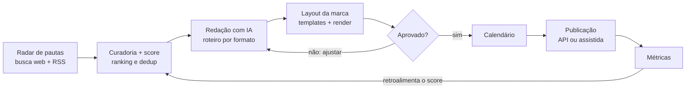

# PRD — App de Geração Automática de Conteúdo (Instagram)

Versão de 27/09/2026 · Pedro Itan

## 1. Visão geral e problema

O app (nome provisório: **Pauta**) transforma notícias e tendências de um nicho em posts prontos para o Instagram — carrossel, feed, story e reel — com a identidade visual da marca, e agenda a publicação. O humano só revisa e aprova.

**Problema.** Marcas, agências e criadores pequenos precisam postar todo dia, mas o ciclo "achar pauta → escrever → diagramar → exportar → agendar" leva de 1 a 3 horas por post. Ferramentas atuais resolvem pedaços isolados: agregador de notícias, editor de design, agendador.

**Proposta.** Um pipeline único: pesquisa por palavras-chave e fontes → curadoria com score de relevância → reescrita original com IA (sem cópia) → layout automático em templates da marca → fila de aprovação → agendamento e publicação via API oficial da Meta.

**Etapa 1:** só Instagram. **Etapa 2:** TikTok, Kwai e YouTube Shorts, reaproveitando o mesmo pipeline e trocando apenas o módulo de saída.

## 2. Objetivos e métricas

O MVP tem sucesso se um usuário sai do cadastro para o primeiro post agendado em menos de 15 minutos e mantém uma cadência de pelo menos 5 posts por semana.

| Objetivo | Métrica | Meta do MVP |
| --- | --- | --- |
| Reduzir tempo de produção | Tempo médio da pauta ao post aprovado | < 10 min |
| Ativação rápida | Tempo do cadastro ao 1º post agendado | < 15 min |
| Qualidade da IA | % de posts aprovados sem edição pesada | ≥ 60% |
| Cadência | Posts publicados por conta ativa/semana | ≥ 5 |
| Retenção | Contas ativas na semana 4 | ≥ 40% |
| Confiabilidade | Publicações agendadas que saem no horário | ≥ 99% |

**Não-objetivos do MVP:** editor de design livre estilo Canva; gestão de comentários e DMs; analytics avançado de concorrentes; publicação em outras redes; app mobile nativo (o MVP é web responsivo/PWA); cobrança (entra depois do teste e da validação do funcionamento básico, com modelo de créditos por formato).

## 3. Personas e casos de uso

| Persona | Contexto | O que precisa do app |
| --- | --- | --- |
| Social media de agência | Gerencia 5–20 perfis de clientes | Várias marcas (workspaces), fila de aprovação com o cliente, calendário por cliente |
| Pequeno negócio / profissional liberal | Posta sozinho, sem designer | Setup guiado da marca, posts prontos com 1 clique, piloto automático |
| Portal de notícias / criador de nicho | Precisa reagir rápido a notícias | Monitoramento de fontes em tempo quase real, alerta de pauta quente, publicação em minutos |

**Casos de uso principais**

1. Configurar a marca uma vez (logo, cores, fontes, tom de voz, nicho, palavras-chave).
2. Receber diariamente uma lista de pautas ranqueadas e escolher quais virar post.
3. Gerar um carrossel a partir de uma notícia, editar texto nos slides e aprovar.
4. Transformar a mesma pauta em story e roteiro de reel.
5. Ativar o **modo piloto automático**: o app gera e agenda N posts/semana e só pede aprovação (ou publica direto, se o usuário permitir).
6. Ver o calendário da semana e arrastar posts entre horários.

## 4. Escopo do MVP — Instagram

O MVP gera e publica os quatro formatos do Instagram em contas profissionais (Business/Creator) pela API oficial da Meta; limites da API definem o que o app pode prometer.

| Formato | Saída gerada pelo app | Tamanho | Restrições da API a respeitar |
| --- | --- | --- | --- |
| Carrossel | 3–10 slides (capa, desenvolvimento, CTA) + legenda + hashtags | 1080×1350 (4:5) | Máx. 10 itens por carrossel via API; conta como 1 post no limite diário |
| Feed (imagem única) | Card de notícia/frase + legenda | 1080×1350 (4:5) | Legenda até 2.200 caracteres, sem negrito/itálico |
| Story | 1–3 telas com manchete e chamada "link na bio" | 1080×1920 (9:16) | Sem stickers (link, enquete, local) via API; sem legenda; publicação restrita a contas Business |
| Reel | Vídeo 9:16 de 15–60 s: texto animado sobre imagens/B-roll, narração TTS opcional, trilha livre de direitos + capa | 1080×1920 (9:16) | Até 90 s para aparecer na aba Reels via API; áudios da biblioteca do Instagram não disponíveis |

**Regras transversais**

- Limite diário de publicações por conta varia (25, 50 ou 100 conforme a fonte): o app consulta `content_publishing_limit` antes de agendar e bloqueia a fila acima do limite.
- Contas pessoais não são suportadas; o onboarding guia a conversão para conta profissional.
- Story com link sticker e trilha do Instagram ficam como "publicação assistida": o app envia notificação push com a mídia pronta para o usuário postar manualmente.

**Roadmap de canais (Etapa 2):** TikTok (Content Posting API), YouTube Shorts (YouTube Data API) e Kwai (sem API pública de publicação confirmada — começar com exportação + publicação assistida). O Reel 9:16 já é a base de vídeo para os três.

Fontes: [Meta — IG User Media](https://developers.facebook.com/docs/instagram-platform/instagram-graph-api/reference/ig-user/media/), [Postproxy — Reels API](https://postproxy.dev/blog/instagram-reels-api-publishing-guide/), [KeyAPI — limites 2026](https://www.keyapi.ai/blog/instagram-api-rate-limits-2026-what-changed-and-how-to-adapt/), [bundle.social — guia de produção](https://bundle.social/blog/instagram-graph-api).

## 5. Requisitos funcionais por módulo

Sete módulos; cada requisito tem prioridade P0 (MVP obrigatório), P1 (MVP desejável) ou P2 (pós-MVP).

**M1 — Marca (Brand Kit)**

- P0: upload de logo (claro/escuro), paleta de 3–6 cores, 2 fontes (título/corpo), handle do @.
- P0: tom de voz (formal, informativo, descontraído, provocativo) + exemplos de posts de referência.
- P1: extração automática de cores e fontes a partir do site ou de 3 posts antigos do perfil.
- P1: múltiplas marcas por conta (workspaces para agências).

**M2 — Radar de pautas (pesquisa)**

- P0: palavras-chave positivas e negativas, idioma e região (padrão pt-BR).
- P0: **busca na web por API** (Tavily, Exa ou Serper) como fonte principal, trazendo URL, trecho e data de cada resultado para citação.
- P0: fontes complementares: Google News/RSS, lista de sites e feeds definidos pelo usuário.
- P1: tendências (Google Trends, hashtags em alta), Reddit, YouTube.
- P0: deduplicação de notícias iguais em fontes diferentes (clusterização por embedding).
- P0: **score de pauta** = relevância para as keywords × frescor × autoridade da fonte × potencial de engajamento; ordena o feed de pautas.
- P1: alerta de "pauta quente" por push/e-mail quando score passa de um limiar.

**M3 — Redação com IA**

- P0: reescrita original a partir de 1+ fontes, no tom da marca, sem copiar trechos (checagem de similaridade < 30%).
- P0: roteiro por formato: slides do carrossel (gancho, 3–8 pontos, CTA), texto de feed, telas de story, roteiro de reel com marcação de tempo.
- P0: legenda, 5–15 hashtags, texto alternativo e crédito da fonte original.
- P0: **cada etapa salva seu resultado** (briefing da pesquisa com citações → roteiro em JSON → mídia renderizada) em `PipelineRun`; "Pedir ajuste à IA" refaz só a etapa necessária, sem pesquisar de novo.
- P0: checagem de fatos: destacar números, datas e nomes com link para o trecho da fonte (usa as citações da busca na web).
- P1: 3 variações de gancho para escolher; reescrever slide individual.

**M4 — Estúdio de layout**

- P0: biblioteca de templates por formato (mín. 6 carrossel, 4 feed, 4 story, 3 reel) que herdam o Brand Kit.
- P0: preenchimento automático e ajuste de texto (auto-fit, quebra de linha, limite por slide).
- P0: imagem de fundo: da própria notícia (quando licenciável), banco de imagens livre (Unsplash/Pexels) ou geração por IA via kie.ai (Higgsfield como alternativa). O texto do slide é sempre renderizado pelo template, nunca pela IA de imagem, para manter a marca legível e editável.
- P0: edição leve: texto, trocar imagem, trocar template, reordenar slides.
- P0: renderização para PNG/JPG (imagem) e MP4 H.264 (reel).
- P2: editor livre de elementos.

**M5 — Aprovação**

- P0: fila "Para revisar" com pré-visualização fiel ao Instagram (feed, grid e story).
- P0: aprovar, pedir ajuste à IA com instrução em texto, descartar.
- P1: aprovador externo (cliente da agência) por link sem login.

**M6 — Calendário e publicação**

- P0: conexão com a conta profissional via login da Meta; renovação automática de token.
- P0: calendário semanal/mensal, arrastar e soltar, horários sugeridos por formato.
- P0: publicação automática via Content Publishing API com fila, retry e status (agendado, publicando, publicado, falhou).
- P0: publicação assistida (push com mídia pronta) para o que a API não suporta.
- P1: piloto automático: X posts/semana por formato, com ou sem aprovação.

**M7 — Métricas**

- P1: alcance, curtidas, salvamentos, compartilhamentos por post (Insights API; exige ≥ 1.000 seguidores para alguns dados).
- P1: retroalimentar o score de pauta com o que performou melhor.

## 6. Fluxos do usuário e telas

O fluxo central é linear até a aprovação; ajustes voltam para a redação e as métricas realimentam o ranking de pautas.

**Onboarding (meta: < 15 min até o 1º post)**

1. Cadastro (Google/e-mail) → conectar conta do Instagram via Meta.
2. Brand Kit: logo, cores, fontes, tom de voz (com extração automática se possível).
3. Nicho e palavras-chave + fontes sugeridas.
4. Primeiro radar carregado → escolher 1 pauta → gerar carrossel → aprovar → agendar.

**Telas do MVP**

| Tela | Função | Elementos-chave |
| --- | --- | --- |
| Dashboard | Visão do dia | Pautas quentes, fila de revisão, próximos posts, uso do limite diário |
| Radar | Escolher pautas | Cards com fonte, score, frescor, botão "Gerar" por formato |
| Estúdio | Revisar e editar post | Preview no mockup do celular, lista de slides, texto editável, troca de template, legenda |
| Calendário | Agendar | Semana/mês, drag-and-drop, cor por formato, status |
| Brand Kit | Identidade | Logo, cores, fontes, tom, templates ativos |
| Configurações | Conta e automação | Contas conectadas, piloto automático, keywords, fontes, plano |

## 7. Arquitetura técnica e stack

Tudo roda na Vercel + Supabase, sem servidor de workers separado: pesquisa e geração acontecem **sob demanda**, quando o usuário clica, e um único cron por minuto publica o que está agendado. Isso exige o plano **Vercel Pro** (funções de até 800 s e cron a cada minuto; no Hobby o cron roda só 1x por dia, com ±59 min de precisão).

| Camada | Escolha | Motivo |
| --- | --- | --- |
| Front-end | Next.js (App Router) + TypeScript + Tailwind + shadcn/ui | Padrão amplo, PWA fácil, bom para o Devin |
| Back-end | Route handlers / server actions do Next.js na Vercel (Fluid compute) | Um único repositório e um único deploy |
| Banco, auth e storage | Supabase (Postgres + pgvector, Auth, Storage) | Embeddings, login e mídia no mesmo lugar |
| Agendamento | Vercel Cron a cada minuto → rota `/api/cron/publish` | Substitui fila/Redis; lê a tabela `Schedule` |
| Busca na web | Tavily ou Exa (Serper como opção barata), atrás de uma interface `SearchProvider` | Resultados com URL e trecho para citação |
| LLM | Claude API | Redação, resumo e score com o tom da marca |
| Geração de imagem e vídeo | kie.ai (Nano Banana, Flux, Seedream; Veo, Kling para reels) com Higgsfield como alternativa, atrás de `MediaProvider` | Um só contrato para vários modelos; troca de provedor sem mexer no pipeline |
| Narração (TTS) | ElevenLabs via kie.ai | Mesma conta e créditos da geração de mídia |
| Render de imagem | Satori + resvg (JSX → SVG → PNG) dentro da função | Texto e marca sempre fiéis ao template |
| Render de vídeo | Remotion Lambda (AWS) ou função Vercel de até 800 s | Único ponto pesado; decidir na fase 4 |
| Imagens livres | Unsplash/Pexels API | Opção gratuita antes de gerar por IA |
| Mídia pública | Supabase Storage com URL assinada temporária | A Meta baixa a mídia por URL pública |

**Rotas no lugar dos workers**

- `POST /api/research`: botão "Pesquisar agora" — busca na web e nas fontes, deduplica, calcula score e grava `Pauta` com as citações (streaming de progresso na tela).
- `POST /api/generate`: botão "Gerar" — roteiro, legenda, hashtags, alt text e render dos PNGs; grava `Post` em revisão.
- `GET /api/cron/publish` (cron a cada minuto): pega posts com `publish_at` vencido, consulta o limite da API, cria o container na Meta, publica e registra o resultado; lock por linha (`SELECT … FOR UPDATE SKIP LOCKED`) evita publicação dupla.
- `GET /api/cron/daily` (1x por dia): renova tokens de 60 dias e coleta métricas dos posts de 24 h e 7 dias.
- Radar automático em segundo plano (pesquisa sem clique) passa a ser P1: um cron a cada 1–3 h chamando a mesma lógica de `/api/research`.

**Geração de mídia assíncrona (kie.ai / Higgsfield)**

- As duas APIs funcionam por tarefa: cria a tarefa, recebe um id e o resultado chega por webhook. Isso combina com a Vercel, porque nenhuma função fica esperando o vídeo ficar pronto.
- Rota `POST /api/webhooks/media` recebe o resultado, copia o arquivo para o Supabase Storage (o kie.ai guarda a mídia por cerca de 14 dias) e avança o `PipelineRun`.
- Tarefas que falham não são cobradas nos dois provedores; o app tenta de novo uma vez e depois troca para o provedor alternativo.
- O kie.ai é revenda de modelos de terceiros, mais barato e com estabilidade um pouco abaixo da oficial; por isso o `MediaProvider` permite trocar para Higgsfield ou para a API oficial do modelo sem mudar o pipeline.

Fontes: [kie.ai](https://kie.ai/), [review do kie.ai (bitdoze)](https://www.bitdoze.com/kie-ai-review/), [Higgsfield API](https://higgsfield.ai/blog/higgsfield-api).

**Camada de canais (preparar desde o MVP):** interface `ChannelAdapter` com `validate(media)`, `publish(post)`, `getLimits()`, `getInsights()`. Instagram é o primeiro adapter; TikTok, YouTube Shorts e Kwai entram depois sem mexer no pipeline.

## 8. Modelo de dados

Treze entidades principais; `Post` é o centro, e cada formato é um `Post` com `format` diferente ligado à mesma `Pauta`.

| Entidade | Campos principais |
| --- | --- |
| User | id, email, name, plan, created_at |
| Workspace | id, owner_id, name, timezone, autopilot_config (json) |
| BrandKit | workspace_id, logo_light_url, logo_dark_url, colors[], font_title, font_body, voice_tone, voice_examples[] |
| SocialAccount | workspace_id, channel (instagram, tiktok…), external_id, handle, access_token (criptografado), token_expires_at |
| Source | workspace_id, type (web_search, rss, site, google_news, trends), url, active |
| Keyword | workspace_id, term, kind (include, exclude), weight |
| Pauta | id, workspace_id, cluster_id, title, summary, source_urls[], citations (json: url, trecho, data), published_at, score, status (new, used, dismissed), embedding |
| Post | id, pauta_id, format (carousel, feed, story, reel), template_id, script (json), caption, hashtags[], alt_text, status (draft, review, approved, scheduled, publishing, published, failed, assisted) |
| PipelineRun | id, post_id, stage (research, script, media, render), input (json), output (json), provider, external_task_id, status (pending, running, done, failed), cost, created_at |
| MediaAsset | post_id, order, type (image, video, cover, audio), url, width, height, duration_s, provider |
| Schedule | post_id, social_account_id, publish_at, attempts, external_media_id, error |
| Template | id, format, name, jsx_source, slots (json), is_system |
| Insight | post_id, collected_at, reach, likes, saves, shares, comments |

## 9. Requisitos não funcionais, riscos e compliance

O maior risco não é técnico: é publicar conteúdo copiado ou errado em nome da marca. Por isso a aprovação humana é padrão e o piloto automático sem revisão é opt-in.

**Não funcionais**

- Geração de um carrossel completo (texto + render) em < 60 s; reel em < 3 min.
- Publicação no horário com tolerância de ±2 min e 3 tentativas com backoff.
- Tokens da Meta criptografados em repouso; LGPD: exclusão de conta e dados em até 30 dias.
- Interface em pt-BR primeiro, preparada para i18n; mobile-first (PWA).

| Risco | Impacto | Mitigação |
| --- | --- | --- |
| Plágio / direito autoral de texto | Alto | Reescrita com checagem de similaridade, crédito da fonte, nunca copiar parágrafos |
| Uso de imagem protegida | Alto | Só banco livre, IA ou imagem do próprio usuário; imagem da notícia apenas com licença |
| Alucinação / notícia errada | Alto | Fatos destacados com link, aprovação humana padrão |
| App Review da Meta demorar ou negar | Alto | Submeter cedo (semana 2), vídeo de demonstração, política de privacidade publicada |
| Limites e mudanças da API | Médio | Consultar limite antes de agendar; adapter isolado; publicação assistida como plano B |
| Custo de IA e render por post | Médio | Cache de pautas, modelos menores para score, render sob demanda |
| Conteúdo sensível (política, saúde, tragédias) | Médio | Lista de temas bloqueados por padrão e aviso na revisão |

## 10. Plano de entrega e handoff para o Devin

O beta fechado com 5–10 perfis reais sai na fase 3 (≈ semana 8); reels e piloto automático vêm depois, porque dependem de render de vídeo e de confiança na qualidade da IA. Prazos são estimativas para 1 dev + Devin.

| Fase | Semanas | Entregas |
| --- | --- | --- |
| F0 Fundação | 1–2 | Auth, banco, crons, Brand Kit, App Review da Meta |
| F1 Radar + IA | 3–4 | Busca na web e score, redação por formato, `PipelineRun` |
| F2 Estúdio | 5–6 | Templates, render PNG (Satori), fila de revisão |
| F3 Publicação | 7–8 | Calendário, API do Instagram, **beta fechado** |
| F4 Reels + auto | 9–11 | Render MP4, piloto automático, métricas |
| Etapa 2 | depois | TikTok, YouTube Shorts e Kwai como novos `ChannelAdapter` |

**Como entregar ao Devin**

- [ ] Criar o repositório com este PRD em `docs/PRD.md` e o visual de referência em `docs/design/`.
- [ ] Pedir ao Devin uma sessão por fase, com critério de pronto claro (ex.: "F0 pronta quando login, Brand Kit e conexão Meta funcionam em staging").
- [ ] Começar pela F0 com: scaffold Next.js + Supabase na Vercel Pro, com `vercel.json` já declarando os crons, schema da seção 8 em migrations, tela de Brand Kit.
- [ ] Registrar o app na Meta e submeter App Review (`instagram_business_content_publish`) na semana 2.
- [ ] Manter `ChannelAdapter` como interface desde o início, mesmo com um só canal.
- [ ] Escrever 10 pautas de teste do seu nicho para validar tom e qualidade antes do beta.

**Perguntas em aberto**

- [ ] Nome e identidade visual do produto (o visual de referência usa "Pauta" como provisório).
- [ ] Valores dos créditos por formato (a cobrança por créditos entra só depois do beta; o `cost` de cada `PipelineRun` já mede o custo real por formato).
- [ ] Nicho do beta (notícias locais de Salvador, música, negócios?).
